# Chiuchau Smart Fan Monitoring System — Product Catalog

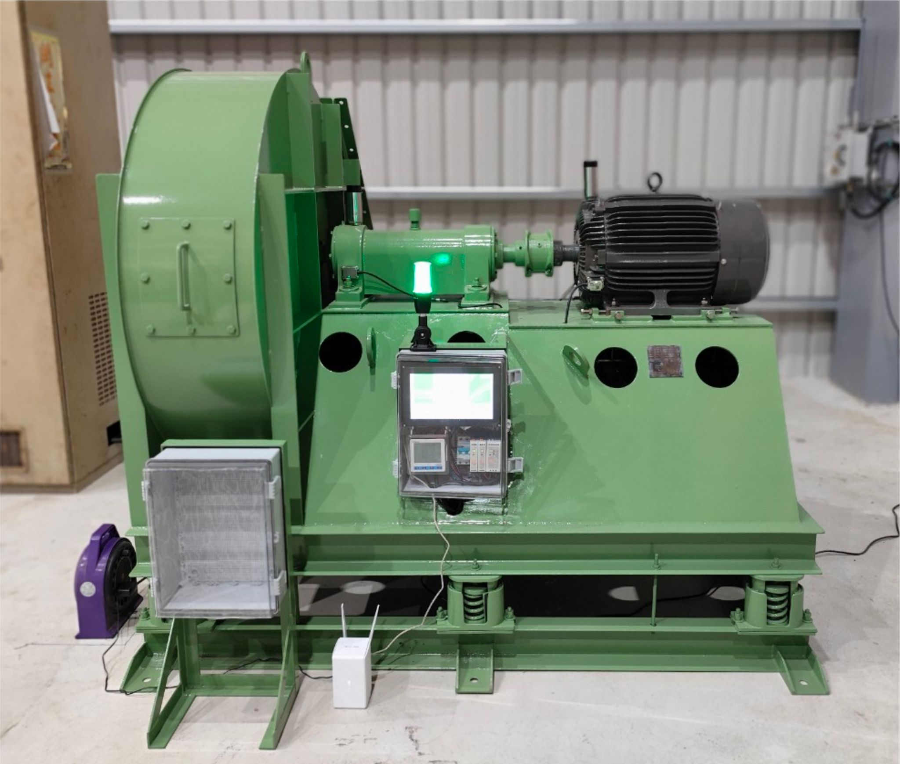

Chiuchau Enterprise Co., Ltd. presents the **Chiuchau Smart Fan Monitoring System**, a comprehensive **intelligent monitoring and predictive health solution** designed for industrial fan equipment. The system integrates **high-precision sensors**, **AI anomaly prediction algorithms**, and a **real-time data visualization platform** to help enterprises monitor equipment status, prevent potential failures in advance, and simultaneously track energy consumption and carbon emissions — achieving the dual goals of **smart maintenance and energy-efficient carbon reduction**.

### **System Features**

✅ **Real-Time Monitoring**: Integrates tri-axial accelerometers, temperature sensors, and power monitoring meters for 24/7 uninterrupted fan operation oversight. Data updates every second with immediate anomaly reporting.

✅ **AI Health Prediction**: Built-in intelligent analysis engine automatically scores health values based on ISO 20816 standards, identifying imbalance, shaft bending, equipment looseness, and other hidden risks in advance. Maintenance teams are notified promptly, enabling planned and preventive maintenance.

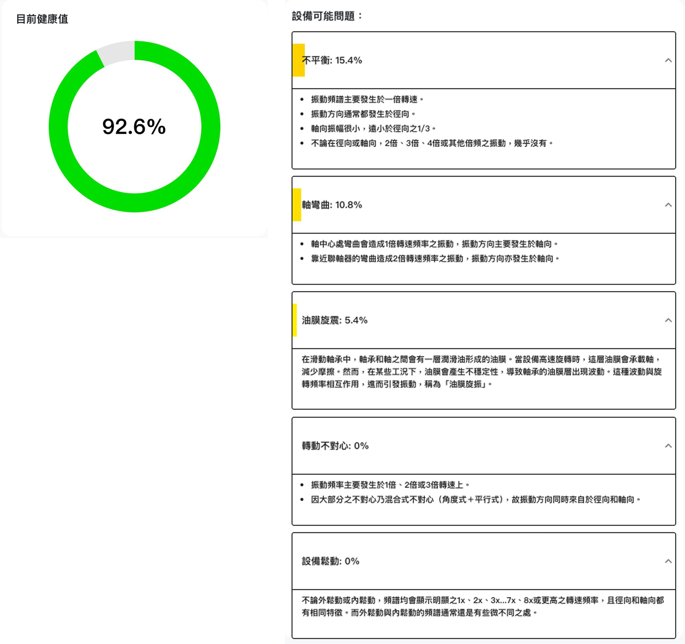

✅ **Instant Alert Notifications**: Abnormal events are immediately pushed to **LINE groups** and **Email**, alerting managers to respond quickly and reducing unexpected downtime risks.

✅ **Carbon Emission Monitoring**: Paired with smart power meters, the system precisely records fan power consumption and converts it to real-time carbon emission data, helping enterprises track **equipment carbon footprints** in compliance with environmental regulations and ESG trends.

✅ **Automatic Monthly Report Generation**: Monthly automated compilation of equipment health trends, anomaly events, and carbon emission records, producing standardized PDF reports for internal management and audit reporting.

### **System Architecture**

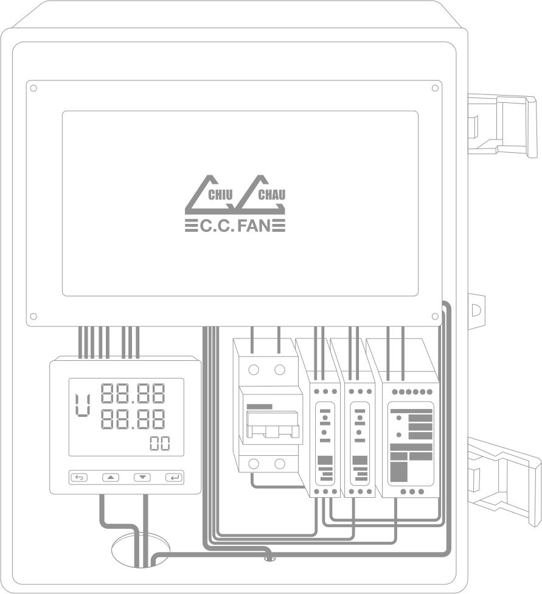

The overall architecture includes the following modules:

- **Monitoring Host**: High-performance single-board computer (quad-core ARM processor, built-in 128GB storage, UPS protection module)
- **Sensors**: Dual-side **tri-axial accelerometers** monitoring motor-side and fan-wheel-side vibration conditions
- **Power Monitoring**: High-precision RJ45 CT input power meter recording voltage, current, power, and energy consumption
- **Communication Module**: Supports Wi-Fi, LoRa, and 4G LTE for flexible adaptation to on-site communication environments
- **Display** (optional): 10.1-inch industrial-grade touch panel for intuitive on-site operation
- **Status Light** (optional): Tri-color status light for real-time equipment health indication

### **Hardware Specifications**

| **Item** | **Specification** |
| --- | --- |
| **Core Processor** | Quad-core 64-bit ARM Cortex-A72, 1.5GHz |
| **Memory** | 2GB LPDDR4 SDRAM |
| **Storage** | 128GB SD Card |
| **Power Module** | UPS expansion module (B), 5V, with power failure protection |
| **Sensors** | Tri-axial accelerometer (X, Y, Z axes), bandwidth 1kHz, ±8g, IP67 waterproof & dustproof |
| **Communication** | Model One: USB/RJ45 wired; Model Air: Wi-Fi, up to 80m; Model LoRa: LoRa, up to 1km |
| **Protection Rating** | IP65: Dust-tight, low-pressure water jet protection; IP67: Short-term water immersion |
| **Power Meter Support** | High-precision RJ45 CT input meter; voltage, current, power & energy monitoring |
| **AI Prediction** | Equipment health monitoring; imbalance, shaft bending, looseness anomaly detection |
| **Real-Time Notifications** | LINE group & Email alerts based on ISO 20816 standards |
| **Report Output** | Auto-generated monthly reports in PDF and CSV formats |
| **Operating Temperature** | -20°C to 85°C |
| **Product Dimensions** | Module control box assembly: 400mm × 300mm × 180mm |
| **Optional Accessories** | Tri-color status light, 4G LTE router & network card, touch display |
| **Cloud Support** | [air.chiuchau.com](http://air.chiuchau.com/) platform for remote monitoring & multi-device management |

### **Software Features**

#### **Dashboard Overview**

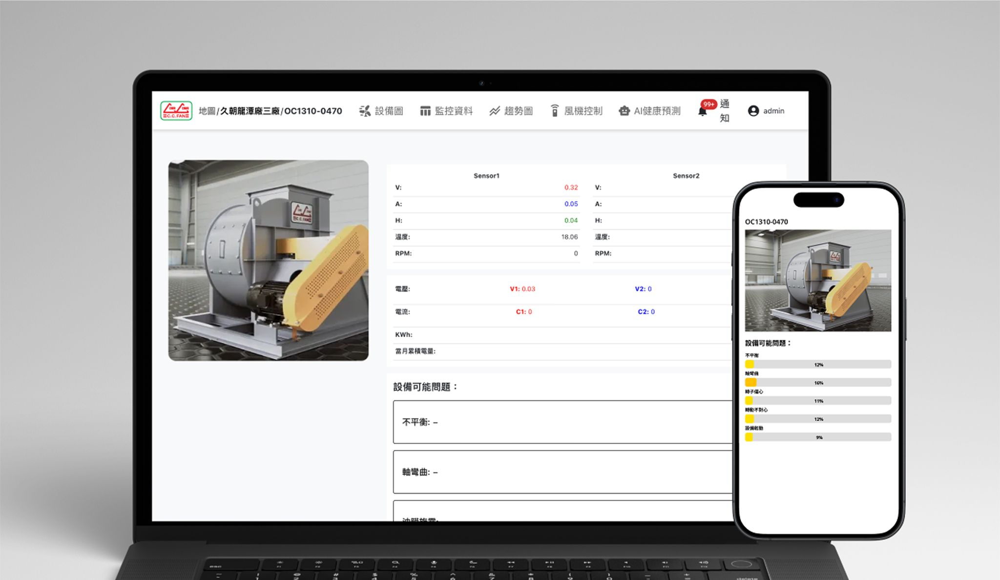
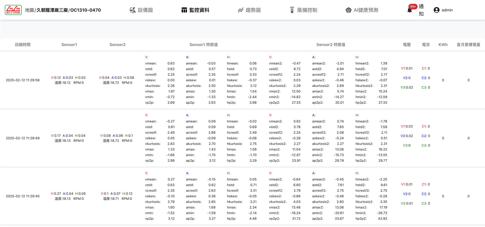
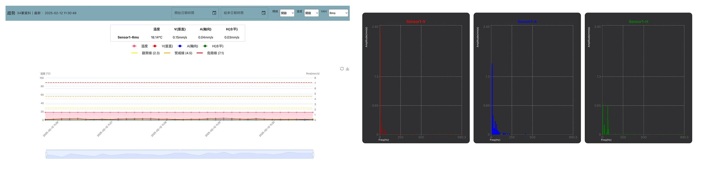
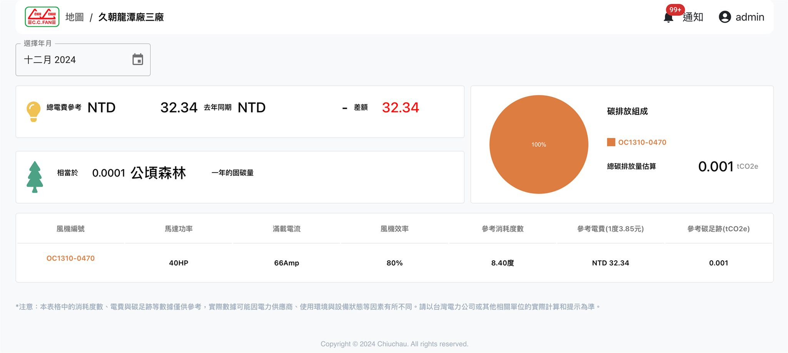
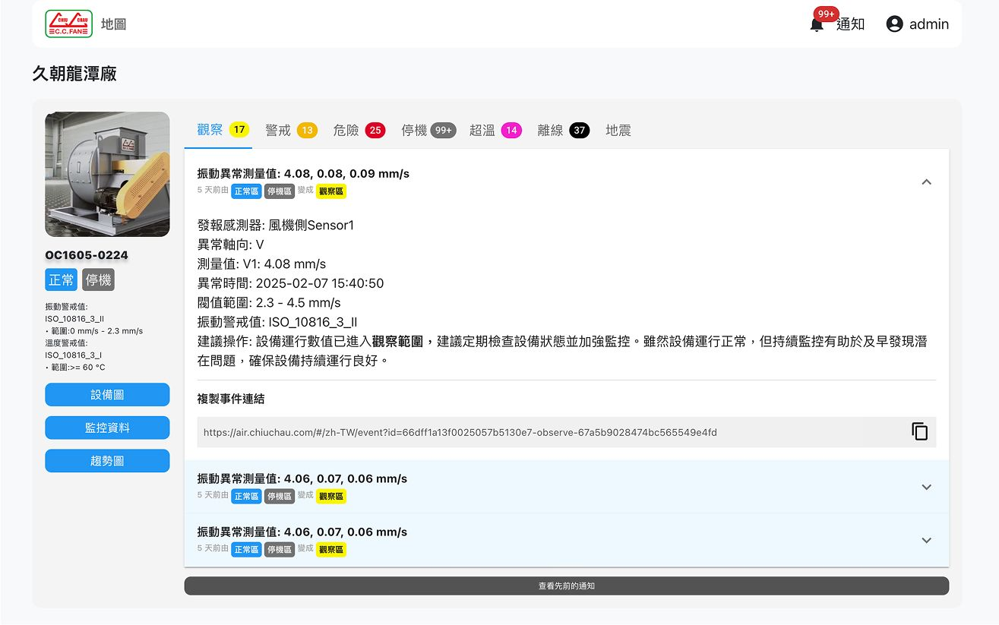

- Real-time equipment visualization for at-a-glance fan health status
- Raw Data tables: vibration, temperature, voltage, and current displayed in real time
- Long-term trend charts + FFT spectrum analysis
- Carbon emission tracking
- Complete anomaly event records

#### **AI Health Prediction**

- Real-time equipment health score calculation with standardized fan status assessment
- Automatic classification into "Observation," "Warning," and "Danger" levels per ISO 20816 standards
- Advance maintenance timing notifications for planned and transparent maintenance

#### **Alert Notification & Management**

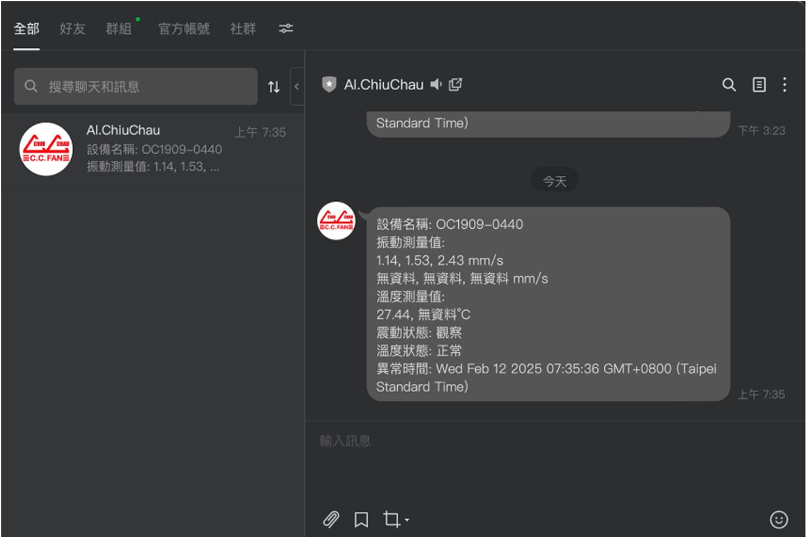

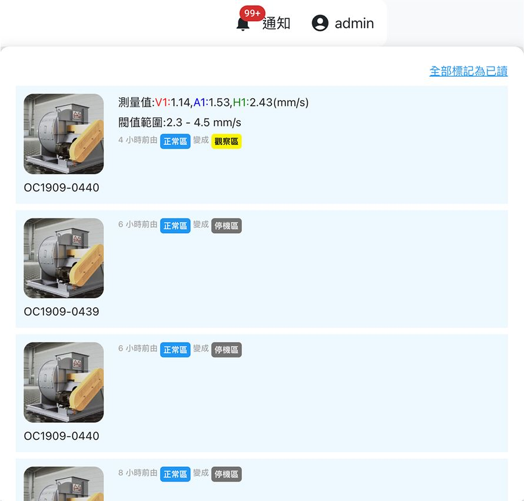

- Event push notifications to **LINE groups** and **Email**
- Notification center in the upper-right corner for reviewing all alert records at any time
- User-customizable alert levels and conditions

#### **Monthly Diagnostic Report**

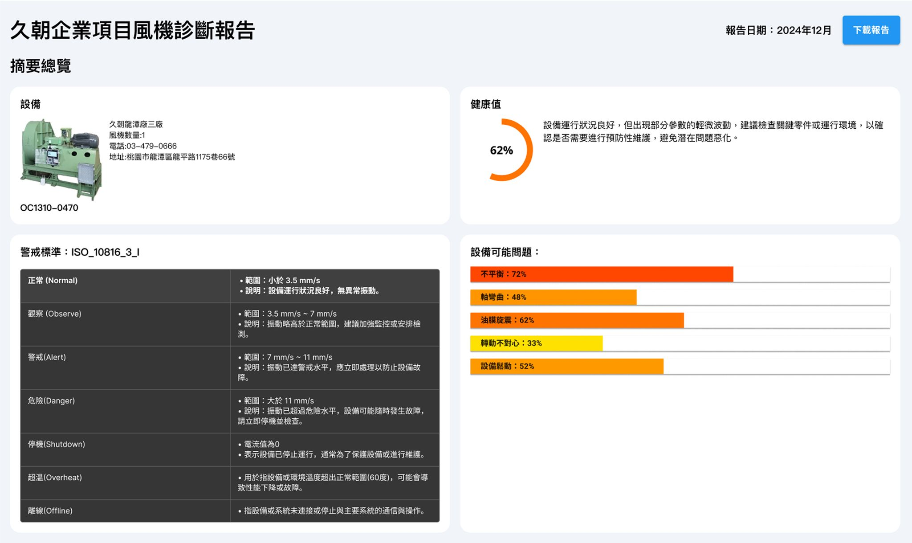
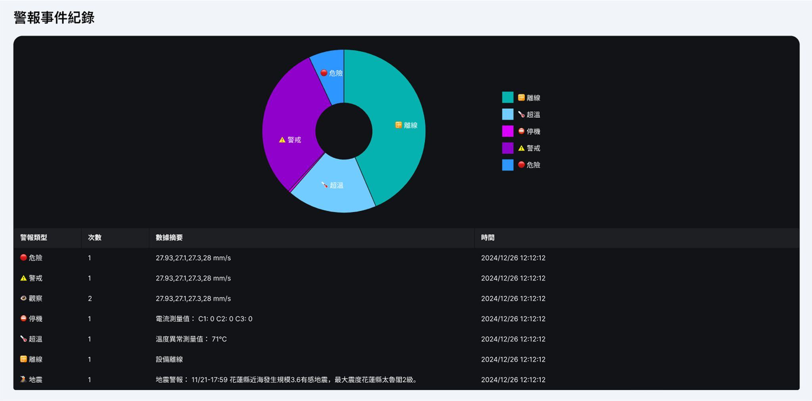
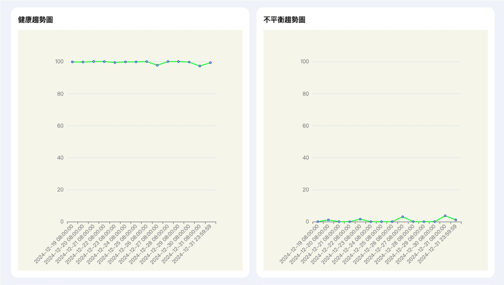
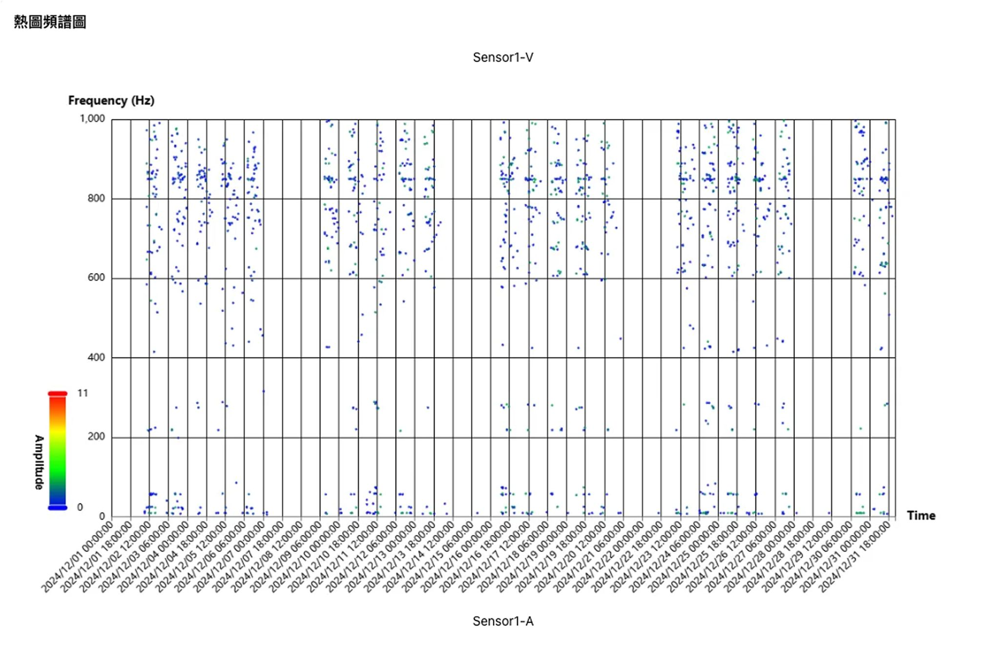
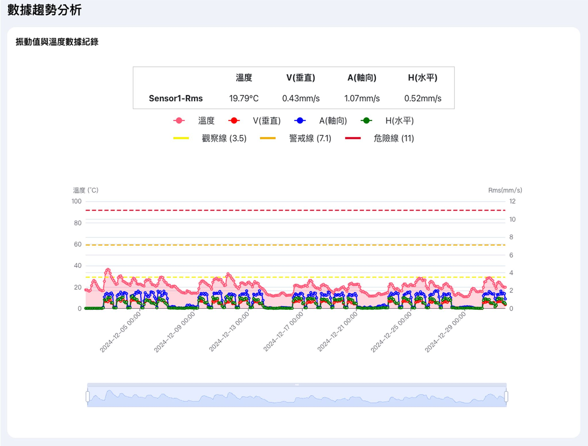

- Automatically generated standardized **PDF reports** each month
- Integrated health trends, anomaly records, and carbon emission statistics
- One report fulfills internal management, audit, and ESG requirements

### **Installation & Maintenance Overview**

- Independent power supply (110V/220V) ensures stable monitoring module operation
- Sensors installed on motor side and fan wheel side, following **VAH orientation** standards
- Power meter installation with appropriate **CT current transformers** based on motor voltage and horsepower
- Sensors, meters, host, and display are factory pre-wired — no on-site configuration needed
- Remote firmware updates and equipment diagnostics supported

### **Contact Information**

📞 Chiuchau Enterprise Technical Support: 03-479-0666 ext. 246

🌐 Official Website: [chiuchau.com](https://www.chiuchau.com/)

📩 Email: service@chiuchau.com

🔗 Technical Support Platform: [air.chiuchau.com/support](https://air.chiuchau.com/support)

**Copyright Notice**

© 2025 Chiuchau Enterprise Co., Ltd. All rights reserved. Unauthorized reproduction or redistribution is prohibited.
