# 久朝智能風機監測系統使用手冊

## 封面

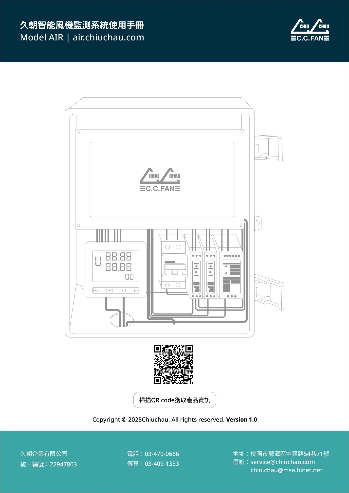

### **目錄**

1. 簡介 - P. 02
1. 安全須知 - P. 03
1. 產品概述 - P. 04
1. 安裝指南 - P. 06
1. 硬體設置與啟動 - P. 14
1. 軟體操作指南 - P. 16
1. 軟體故障排除 - P. 27
1. 技術支援與聯絡方式 - P. 28
1. 附錄 - P. 29

### 1. 簡介

歡迎使用**久朝智能監控系統**。本系統專為工業設備的即時監控與預測性維護而設計，結合最新的感測技術與人工智慧分析，為使用者提供全面而精準的設備健康管理解決方案。我們的系統支援多種工業環境下的應用，從半導體生產到傳統製造業，都能有效提升設備運行效率、降低維護成本，並預防突發故障，實現無縫的智慧化生產管理。

本系統包含**硬體設備**與**軟體平台**兩大部分。硬體方面，我們提供高精度三軸振動感測器、溫度感測模組、電力監控設備，並具備多種通訊技術如 Wi-Fi、LoRa、4G LTE，確保資料穩定傳輸至雲端或本地伺服器。系統內建 UPS 電源保護模組，能夠在突發斷電時保護資料安全，確保持續運行。

在軟體層面，系統支援即時資料視覺化、異常狀態警報（依據 **ISO 20816 振動標準**），以及設備健康 AI 預測模型，幫助使用者精準掌握設備狀態。透過智慧演算法，系統能夠提前預測潛在故障，並提供維護建議。此外，使用者可設定 **Line 群組通知**與**電子郵件綁定**，確保異常發生時即時收到警報提醒。

本系統還支援**碳排放監控模組**，可追蹤設備能耗與碳排資料，幫助企業實現節能減碳目標，符合環保法規要求。所有資料將自動整合產生每月診斷報告，清晰呈現設備運行趨勢與健康評估，助您做出更科學的決策。

**久朝智能監控系統**致力於提供高效、可靠且靈活的解決方案，無論是面對嚴苛的半導體無塵室環境，還是一般工業場景，我們都能滿足您的需求。透過我們的系統，您將能夠有效提升設備可靠性，降低維護成本，並大幅提升生產效率。

## 2. **安全須知**

為確保您在使用久朝智能監控系統的過程中能夠安全且有效地操作，請務必詳細閱讀以下安全須知。本系統涉及高壓電設備及資料傳輸，請遵循相關的操作規範，以避免意外發生或設備損壞。

---

#### 2.1 電源與安裝安全

- **獨立電源供應**：請確保監控模組採用獨立的 110V/220V 電源供電，並符合當地電氣安全規範。
- **高壓接線警示**：連接至馬達的高壓電源（380V/440V）需由持證電工操作，嚴禁在通電狀態下進行接線或維修。
- **接地要求**：為避免靜電干擾和電擊風險，所有設備必須確實接地。
- **UPS 電源保護**：系統內建 UPS 模組，可在突然斷電時自動保護資料，請勿自行拆卸或改動 UPS 模組。

---

### 2.2 設備操作安全

- **防水防塵要求**：本系統具備 IP65/IP67 防護等級，請確保安裝過程中不損壞防護密封，避免水氣或灰塵進入設備內部。
- **防爆環境限制**：若需在防爆區域安裝，請確認設備符合 IEC 防爆認證標準，並嚴格遵守相關防爆安裝規範。
- **感測器安裝**：安裝振動感測器及電流互感器（CT）時，請確認已切斷所有電源，並避免感測器接觸高溫或腐蝕性物質。

---

### 2.3 通訊與資料安全

- **網路安全設定**：請確保 Wi-Fi、LoRa 或 4G LTE 連線已啟用加密協定（如 WPA2），以防止資料遭未經授權存取。
- **資料保護**：所有監測資料將加密儲存於雲端或本地伺服器，請勿使用未經授權的第三方軟體操作資料。
- **韌體更新**：定期檢查並更新系統韌體，以確保系統的安全性和穩定性。更新檔案請僅從官方平台下載。

---

### 2.4 維護與檢修注意事項

- **斷電維修**：進行任何維護或檢修前，請務必關閉電源，並確保系統完全斷電。
- **避免擅自改裝**：請勿擅自修改硬體或軟體，否則可能導致系統故障或安全隱患，並可能影響保固。
- **定期檢查**：建議定期檢查感測器和資料線路的狀態，確保設備穩定運行。

---

### 2.5 緊急狀況處理

- **設備異常**：若系統偵測到異常（如溫度過高、異常振動、電流異常等），將自動傳送警報至指定的 LINE 群組或電子郵件信箱。請立即依照系統建議進行檢查或停機處理。
- **火災或電擊風險**：若發現設備冒煙、過熱或有燒焦氣味，請立即切斷電源並撤離現場，避免自行嘗試修理，應聯絡專業維護人員。

---

### 2.6 其他注意事項

- **教育訓練要求**：僅限經過專業訓練的操作人員使用本系統，避免未經授權操作導致安全風險。
- **環保與回收**：報廢或更換的設備應依照當地環保法規進行回收處理，避免隨意丟棄。

---

請務必遵守以上安全須知，以確保操作安全及設備穩定運行。如有任何疑問，請聯絡久朝企業客服或技術支援團隊。

## 3. 產品概述

### 3.1 系統架構

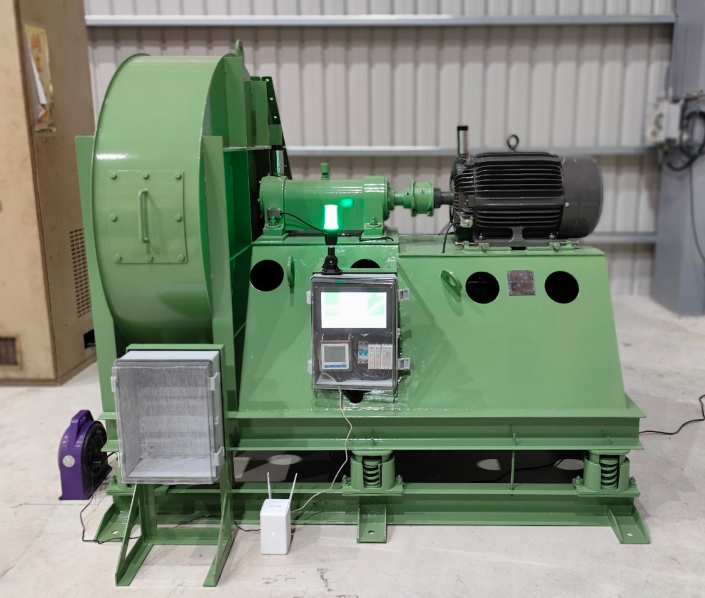

### 3.2 監控模組主要組成

- 各元件功能介紹
- 3.3 產品規格

## 4. 安裝指南

### 4.1 硬體安裝

- **電源拉線說明**

4.2 感測器安裝（位置選擇與固定方式）

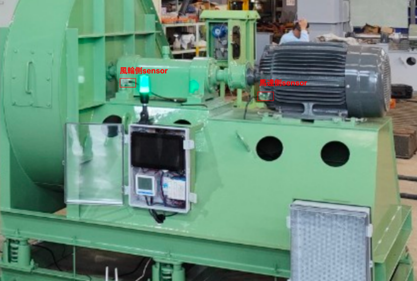

#### 4.2.1 安裝位置說明

系統標配兩顆高精度三軸加速度感測器，用於監測風機的振動狀態，並依據不同部件的特性安裝於以下位置：

1. **馬達側感測器：**
1. **風輪側感測器：**

#### 4.2.2 安裝方向參考（VAH 方位）

感測器安裝需依據 **VAH（垂直 V、軸向 A、水平方向 H）方位** 進行精確定位，以確保資料的準確性和可比較性。

- **V 軸（垂直方向）：** 指向設備的垂直方向，用於偵測上下振動。
- **A 軸（軸向）：** 與馬達軸線平行，用於監測軸向振動，特別是軸對中狀況。
- **H 軸（水平橫向）：** 與設備水平面平行，垂直於 A 軸，用於偵測橫向振動異常。

#### 4.2.3 固定方式

為確保資料準確及長期穩定運行，感測器安裝需使用專業固定方式，並避免因鬆動或位置偏移影響監測結果。

1. **螺絲固定（建議）：**
1. **強力黏膠固定（臨時監測使用）：**
1. **磁性底座（可拆卸安裝）：**

#### 4.2.4 安裝注意事項

- 安裝前確保設備表面清潔無油污，以避免感測器固定不穩或資料失真。
- 感測器應避免安裝於焊接接縫或表面不平處，以確保資料準確。
- 感測器線路應避免與高壓電纜並行佈線，減少電磁干擾對資料的影響。
- 安裝後應進行校正測試，確保感測器輸出資料正常穩定。

---

### 4.3 網路與通訊設置

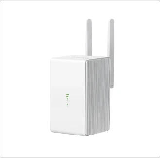

- 4.3.1 基本網路需求

- **硬體配置：**
- **服務說明：**
- **優點：**

#### 4.3.2 通訊協定與技術標準

- **通訊協定：**
- **無線通訊技術：**
- **法規認證：**

#### 4.3.3 安裝與設置步驟

- **網路環境檢測：**
- **設備連線設置：**
- **網路監控與維護：**

---

本說明提供完整的網路與通訊設置指南，確保客戶在不同網路環境下均能穩定運行監控系統。

### 4.4 選配件安裝

#### 4.4.1 三色狀態燈

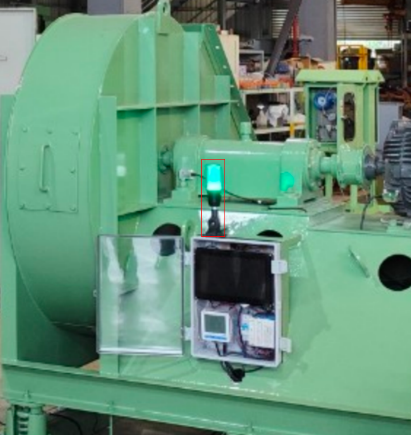

三色狀態燈（紅、黃、綠）用於即時顯示設備運行狀態，幫助現場人員快速掌握設備健康狀況與異常警報。正確的安裝位置能確保燈號清晰可見，提升操作效率與安全性。

- **安裝位置建議**
- **安裝步驟**
- **使用與維護**

正確安裝與使用三色狀態燈能有效提升設備運行的視覺化管理，幫助現場人員迅速判斷設備狀態，進一步降低故障風險，確保作業現場的安全與效率。

#### 4.4.2 4G LTE 路由器 + 網卡

請參考「網路與通訊設置」章節。

#### 4.4.3 觸控顯示器

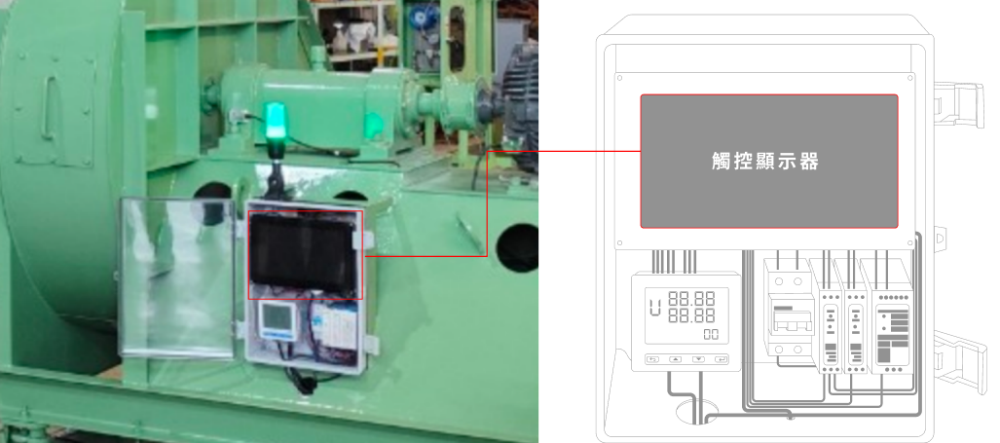

觸控顯示器提供直覺的操作介面，方便現場人員即時查看設備資料、警報狀態及歷史紀錄，並進行基本的系統設定與控制。

- **安裝說明**
- **操作說明**
- **維護與注意事項**

觸控顯示器提供使用者直覺便捷的操作體驗，幫助現場管理人員快速掌握設備狀況，提升操作效率與設備管理便利性。

#### 4.4.4 高精度 RJ45 CT 輸入電表

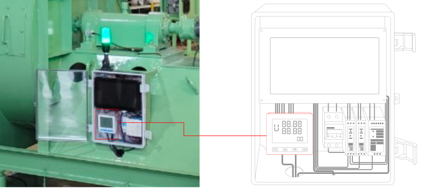

- **高精度 RJ45 CT 輸入電表安裝說明**
- **安裝說明**
- **注意事項**

## 硬體設置與啟動

### 5.1 系統啟動流程

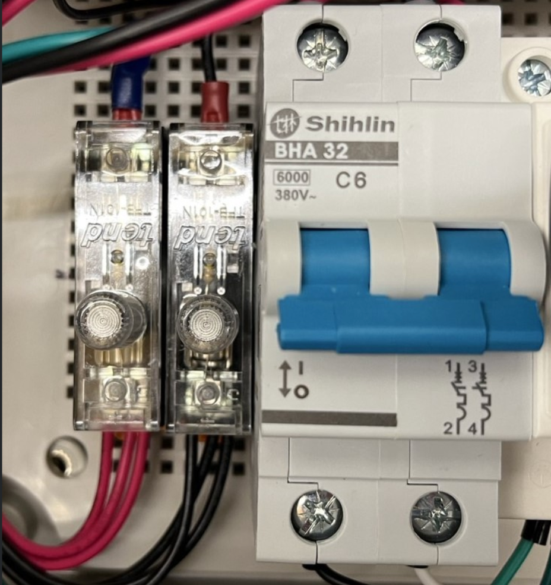

110V/220V 電源安裝完成後，將開關向上開啟以通電。

- 若需關機，可直接將開關向下撥斷電，內部會自動執行關機程序，約等待 10~15 秒。當下方繼電器的燈號熄滅一次後，即可進行下一次重新開機。

### 5.2 初次安裝的硬體檢測

- 將開關向上開啟通電後，檢查電源供應器的燈號是否亮綠色（DC OK）。
- 檢查路由器是否持續亮綠燈。
- 檢查訊號接收是否正常運作（亮起紅燈和綠燈）。

### 5.3 硬體故障排除指南

- 將開關向上開啟並通電後，若發現電源供應器的指示燈未亮，可能是保險絲燒毀所致，此時需更換保險絲（2A/250V 快熔保險絲，規格 6.35×32mm）。

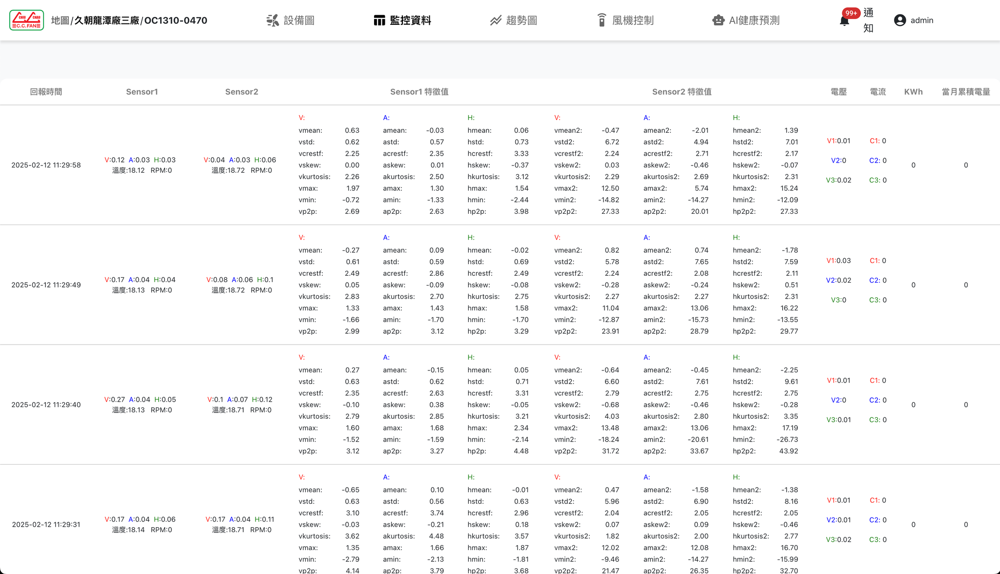

- 若三色燈未依序從綠色 → 橙色 → 紅色顯示，請重新開機（參考「系統啟動流程」第三點）。
- 若無法正常關機或重新啟動，請關閉監控系統的控制板後再重新開啟。

---

## 6. 軟體操作指南

### 6.1 核心特色與優勢

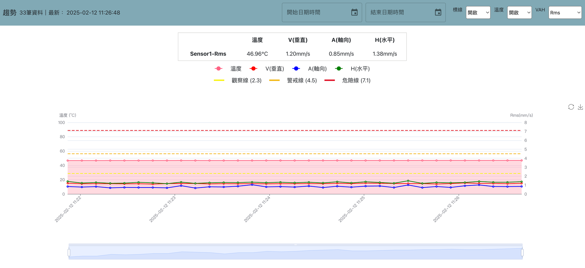
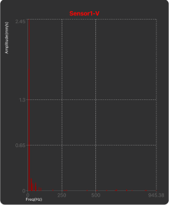
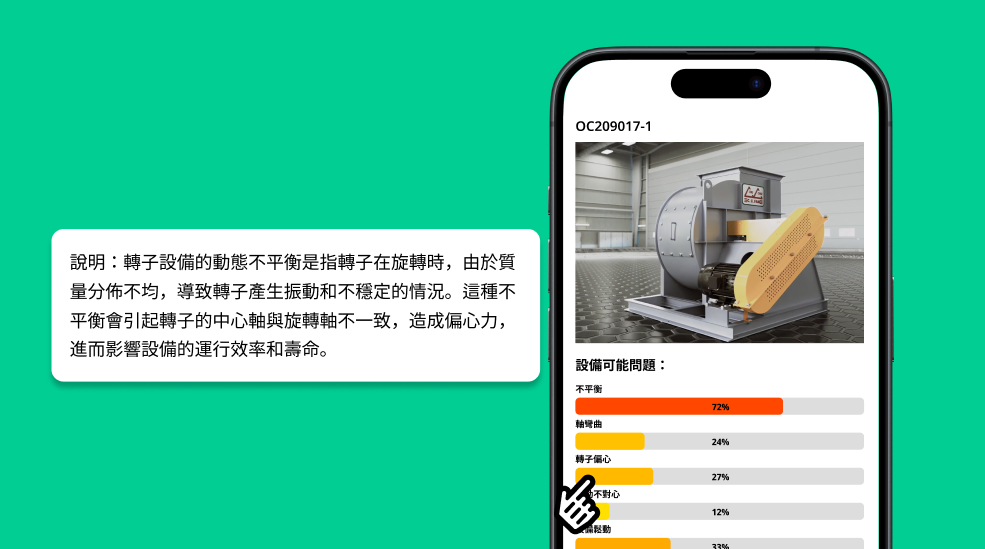
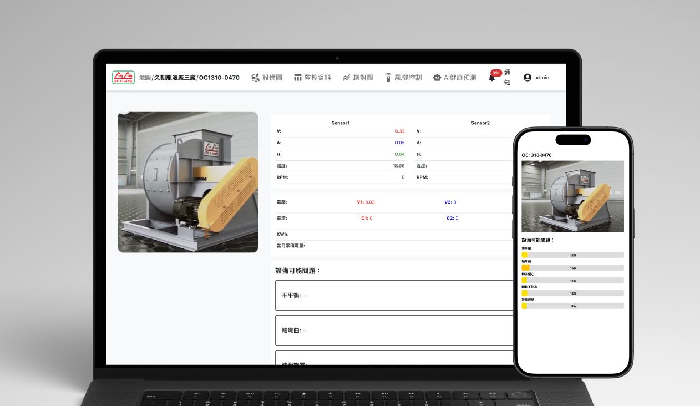
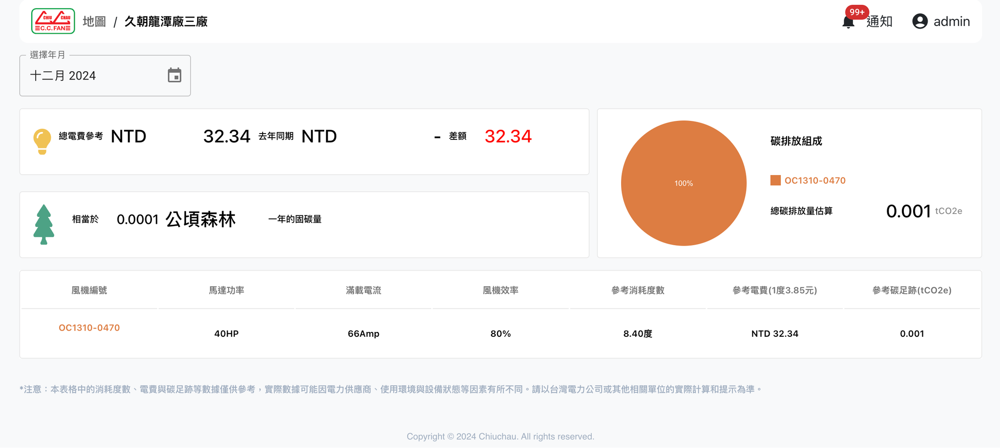

- 即時監控與分析

提供設備的即時運行資料監測，包括振動、溫度等關鍵參數，並支援趨勢圖及 FFT 頻譜分析。

- **AI 智慧預測**

結合 AI 預測模型，提前預測設備潛在的異常與故障，降低維護成本並提升運行效率。

- 多平台支援

支援使用者透過各種終端設備（手機、平板、電腦）遠端查看設備的運行狀況。

- 碳排追蹤

設備異常時立即發出警報通知，並提供碳排放追蹤功能。

### 6.2 設備圖

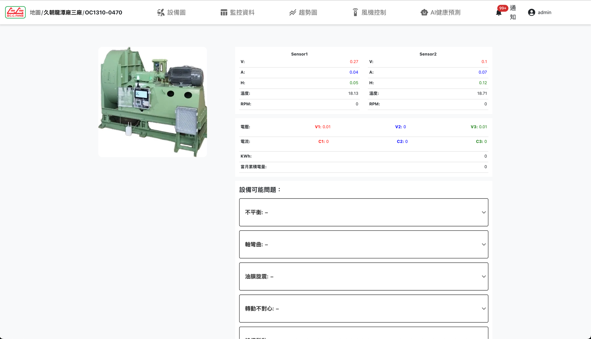

提供設備即時視覺化狀態顯示，快速掌握每台設備的關鍵運行資訊。

### **6.3 監控資料**

以表格方式呈現原始資料（Raw Data），包括溫度、振動、電流等詳細指標，便於進行進一步分析。

### **6.4 趨勢圖**

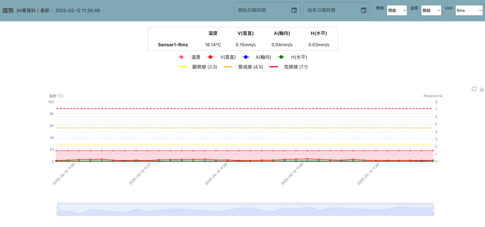
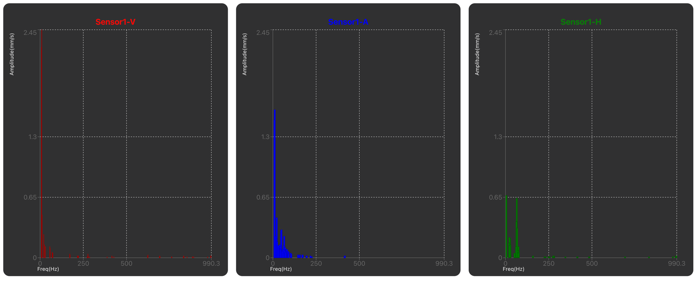

顯示設備運行資料隨時間的變化趨勢，幫助使用者判斷設備長期運行狀態。

### **6.5 碳排監控**

即時監控設備的碳排放資料，協助企業達成節能減碳目標。

---

### 6.6 資料分析功能

- 異常判讀與健康值

---

### 6.7 通知與警報設定

- Line 群組通知設定
- 警報通知常駐
- 警報管理
- 警報通知依據

---

### 6.8 每月報表產生功能

#### 自動產生月度報表

系統自動產生完整設備運行報告，記錄振動、溫度、電流、電壓等關鍵參數資料。

#### 異常事件追蹤

詳細記錄每次異常事件，包括觸發時間、系統回應及維護建議等完整資訊。

#### 碳排放與設備健康監測

追蹤碳排放資料並監控設備健康值，提供未來趨勢預測分析。

#### 地震警報整合

即時整合地震警報資訊，快速評估並排除地震對設備造成的潛在損害。

- **自動產生報表設定**
- **報表格式與輸出（PDF）**
- **報表內容解讀指南**

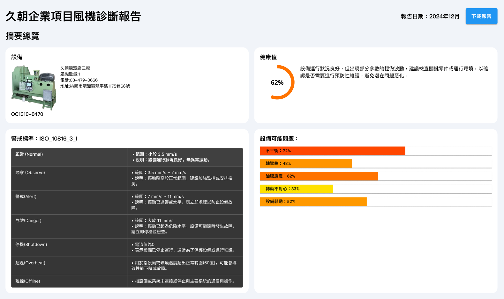

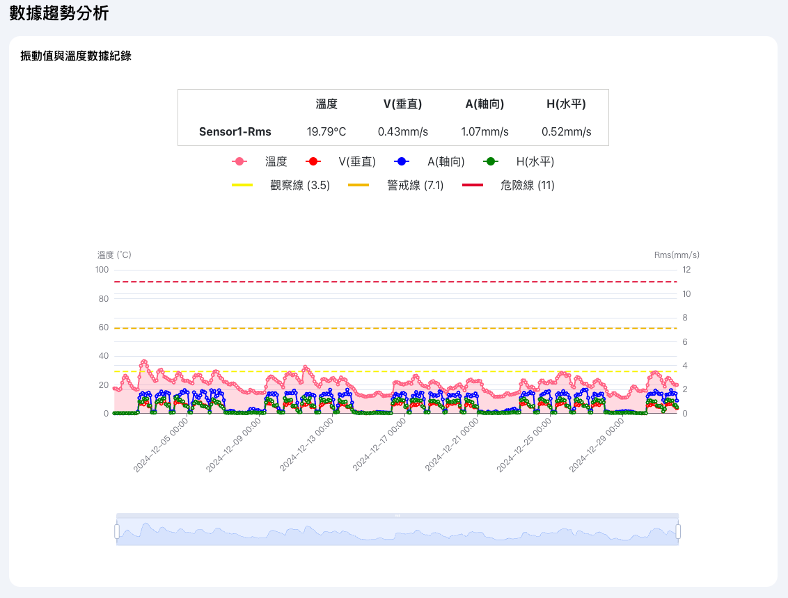

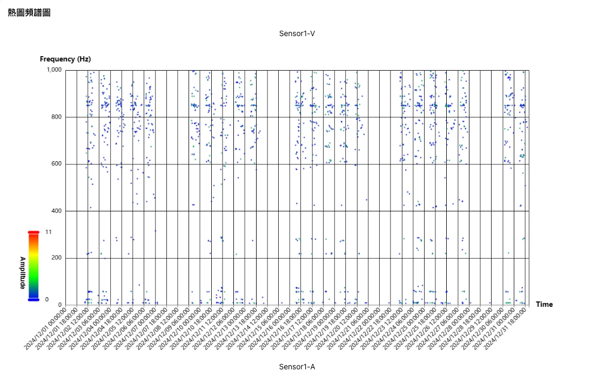

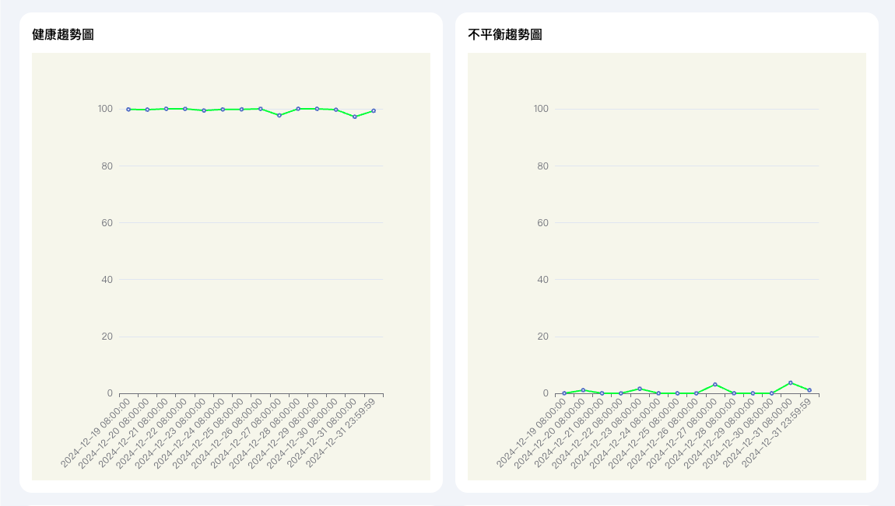

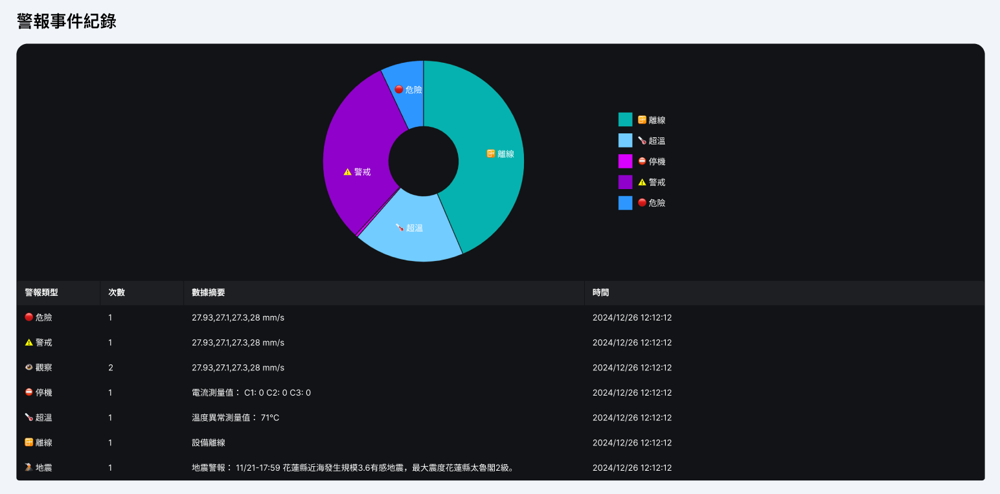

---

## 7. 軟體故障排除

#### 7.1 無法登入系統

**可能原因與解決方案**

- **網路連線異常**
- **帳號或密碼輸入錯誤**
- **系統維護或伺服器異常**

---

#### 7.2 資料更新延遲或異常

**可能原因與解決方案**

- **伺服器運行異常**
